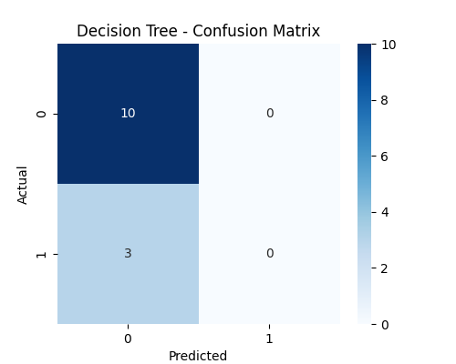
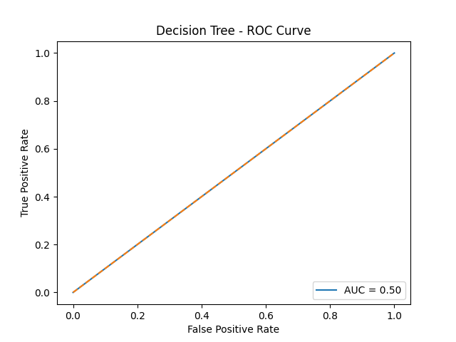
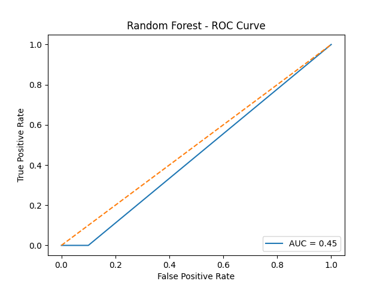

# Kyphosis Tree-Forest Predictor 🌲🌳

A machine learning project to predict the presence of kyphosis (a spinal condition) after surgery using decision trees and random forests.

---

## 📂 Project Structure

```

kyphosis-tree-forest-predictor/
├── config/ # YAML config for paths + hyperparameters
├── data/ # raw + processed data splits
├── models/ # saved KNN model & metrics
├── outputs/ # confusion matrix, ROC, decision boundary
├── src/
│ ├── data/ # preprocessing script
│ ├── features/ # scaling script
│ ├── models/ # train + evaluate scripts
├── run.py # master pipeline runner
├── requirements.txt
├── .gitignore
└── README.md

````

---
## 🚀 How to Run

1. Install dependencies:

```bash
pip install -r requirements.txt


## ⚙️ How to Run

1️⃣ **Preprocess & split data**  

python src/data/preprocess.py

2️⃣ **Scale features**  

python src/features/build_features.py

3️⃣ **Train & tune**  

python src/models/train_model.py

4️⃣ **Evaluate test performance**  

python src/models/evaluate_test.py

**Or Run Entire Pipeline:**

```bash
python run.py
```

---

## ✅ Final Results

Validation accuracy: ~76%

Models used: Decision Tree, Random Forest

SMOTE applied for class balancing

---
⚙️ Tech Stack

Python 🐍

Scikit-Learn

Pandas & NumPy

Matplotlib

Clean YAML configs

Modular pipeline

## 📊 Outputs






## 🏆 Author
MD TARIKUL ISLAM UTHSO
